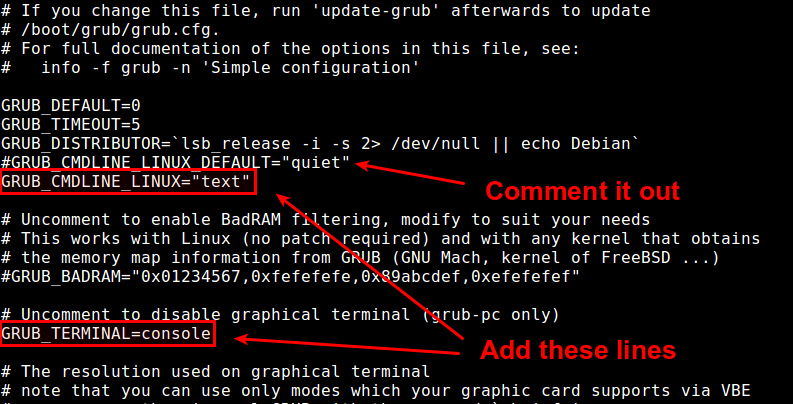

## Start guest in text mode by default

1. Open a default GRUB config file with a text editor.

   ```$ sudo vi /etc/default/grub```
   
2. Look for a line that starts with GRUB_CMDLINE_LINUX_DEFAULT, and comment out that line by prepending # sign. This will disable the initial splash screen, and enable verbose mode (i.e., showing the detailed booting procedure). Then change GRUB_CMDLINE_LINUX="" to:

     ```GRUB_CMDLINE_LINUX="text"```

3. Next, uncomment the line that says "#GRUB_TERMINAL=console". The updated GRUB defult configuration looks like the following.

   

4. Finally, invoke ```update-grub``` command to re-generate a GRUB2 config file under /boot, based on these changes.

   ```$ sudo update-grub```

   At this point, your desktop should be switched from GUI booting to console booting. Verify this by rebooting.

   

5. The following command was needed in Debian Jessie (8) as it uses systemd:

	```systemctl set-default multi-user.target```


* * *
### Source

http://ask.xmodulo.com/boot-into-command-line-ubuntu-debian.html