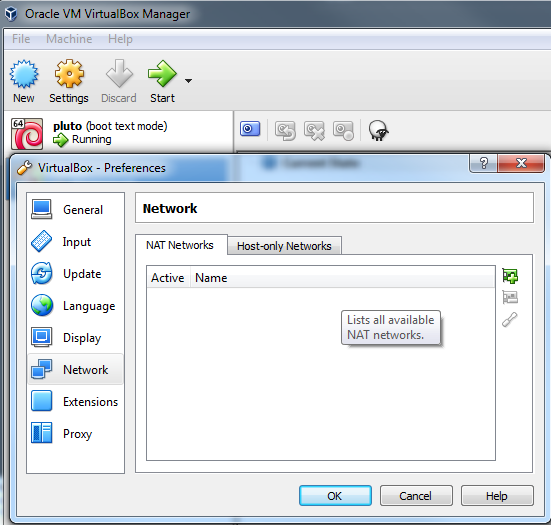
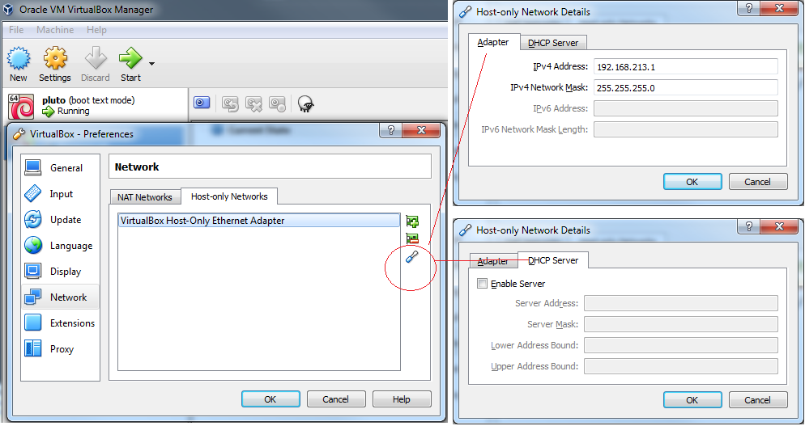
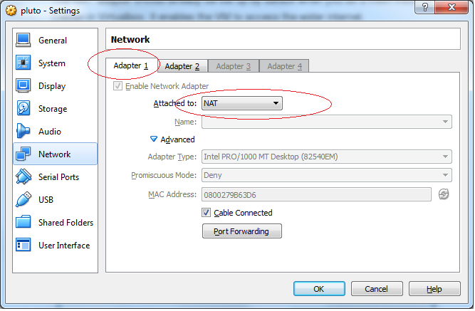
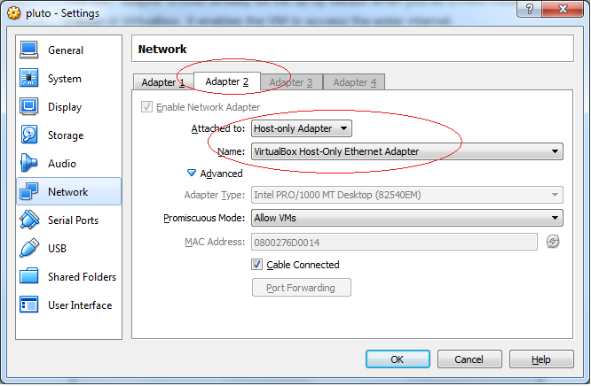

## Windows 7  (64-bit)

### Requirement

* VM needs to be accesible by the Windows host even when the computer is offline.
* When computer is online, VM can access the internet.
* VM should be accessed by host via static IP address so that dev environment setting persist beyond a reboot.

### Solution

0. VirtualBox menu:

   ```File - Preferences - Network```

   ### NAT:
   
   

   ### Host-only:

   Select “Virtualbox Host-only ethernet adapter”. Click the edit button which looks like a screwdriver. Enter an unused network in the 192.168.x.x Ip range. I’m using 213.1 because my router is on 192.168.0.1, but I could use anything in that 3rd octet except 0 I think. The netmask should be 255.255.0.0 but for some reason it still works with 255.255.255.0 – I’m still not quite sure why that is though.

    Click the “DHCP server” tab and uncheck the ‘Enable Server’ checkbox – we don’t need DHCP because we’ll be using a static IP address.

      

1. Two virtual network adapters in the VM’s network tab in Virtualbox:

   ```Machine - Settings - Network```

  - Adapter #1: “NAT” / DHCP
  - Adapter #2: “Host-only” / Static IP

  The NAT adapter should already be set up by default when you do a fresh install of Debian in Virtualbox. It enables the VM to access the wider internet.

  Meanwhile the Host-only adapter enables the host machine to see the VM and persists even when internet connectivity drops allowing you to carry on working.

  #### NAT:

   
   
  #### Host-only:

   
   
3. Configure the networking inside the VM

    Log into the VM as root and edit /etc/network/interfaces – it should look like this:

    ```
	# This file describes the network interfaces available on your system
	# and how to activate them. For more information, see interfaces(5).
	
	source /etc/network/interfaces.d/*
	
	# The loopback network interface
	auto lo
	iface lo inet loopback
	
	# the NAT virtual adapter
	allow-hotplug eth0
	iface eth0 inet dhcp
	
	# the Host-only virtual adapter
	auto eth1
	iface eth1 inet static
	
	address 192.168.213.9 
	#this must match VirtualBox host-only network
	
	netmask 255.255.255.0
    
    ```

4. Reset the VM and you should now be up and running

   ```
   $ ifup eth0
   $ ifup eth1
   ```
  

* * *
### Source

Based on http://blog.xoundboy.com/?p=586
